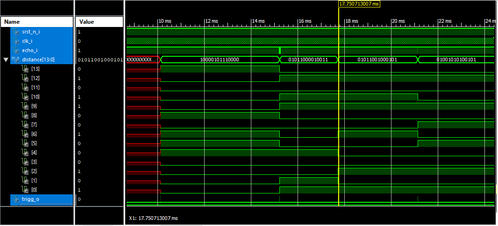

# Ultrasonic ranging module

## Summary

1. [Description](#Description)
2. [HC-SR04 module](#HC-SR04-module)
3. [Code description](#Code-description)
4. [Results](#Results)
5. [References](#References)

## Description

>Our goal in this project is creation of *field-programmable gate array* which will measure distance between  
>its sensors and a detectable object. The object must be at a distance between 2 centimeters and 4 meters
>and also must not deviate more than 15 degrees away from the detectors axis. 
>For this purpose we will be using [HC-SR04 module](#HC-SR04-module) mounted on Coolrunner II CPLD board.

### Schematic

 

## HC-SR04 module
*All informations about connection pins, functionality and timing* 
*have been drawn from enclosed HC-SR04.pdf file*
>This module consists of ultrasonic emitter and receiver and necessary circuitry to achieve its function. Connection with board 
>is transmitted via four pins as follows: **Ucc**, **Trig**, **Echo** and **GND**. **Ucc** and **GND** are 
>used for powering the module with **+5V** voltage. After sending 10us 40 kHz signal to **Trig** the module emitter sends out 
>burst of 8 40 kHz sonic pulse signals and waits for reflected signals. During this time, between sending and receiving, is signal 
>on pin **Echo** set to logic 1. 
	
## Code-description

>Our objective is to measure time of output from the module, convert it to distance and display it on the 4-digit 7-segment display.
###Driver for HC-SR04 module 
Three inputs: 

* 10 Mhz clock input 
* synchronous reset
* echo - signal timing modules output

Two outputs:

* trigg_o for triggering the module
* distance - distance in mm in binary after division

This driver works as a Finite State Machine (FSM) with three states, described in following diagram.

 

During measurement process a variable s_time is filled with according value, which is then transformed into distance in a combinational section.

## Measurement process

>measurement : process(clk_i)
>	
>	begin
>		
>		if rising_edge(clk_i) then
>			if srst_n_i = '0' then
>				s_cnt <= (others => '0');
>				s_state <= trigg;
>			else
>				case s_state is 
>					
>					when trigg =>
>					
>						if s_cnt < trigtime then
>								trigg_o <= '1';
>								s_cnt <= s_cnt + 1;
>						else
>								trigg_o <= '0';
>								s_cnt <= (others => '0');
>								s_state <= pending;
>						end if;
>					
>					when echo =>
>					
>						if echo_i = '1' then
>								s_cnt <= s_cnt +1;
>						else
>								s_state <= pending;
>								s_time <= s_cnt;
>						end if;
>						
>					when pending =>
>					
>						if s_cnt > 0 then
>								s_cnt <= (others => '0');
>						elsif ((s_cnt = 0) and (echo_i = '1')) then
>								s_state <= echo;
>						else
>								s_state <= pending;
>						end if;
>					end case;
>				end if;
>			end if;
>		end process measurement;
>		
>		
>		dist_mm <= sound_speed *(s_time /2);
>		distance <= std_logic_vector(dist_mm(31 downto 18));

### Binary to Binary Coded Decimal module
This module uses asynchronous process based on shift-left and add 3 algorithm to produce 4-digit binary coded decimal number out of binary number.
We create unsigned binary number of length equal to 4 times 4 bits plus length of binary number we want to decode. First sixteen digits are separated 
to part of four. Then we shift all bits leftwards by one and after each shift we check, whether number in correspondent part is equal or bigger than 5. 
If so, we add 3 to it and repeat the process. Hand-written process is on photo shown below.

 

## Binary to BCD process
>p_bcd: process(distance)
>        variable z: std_logic_vector(N+N_BCD-1 downto 0);
>    begin
>        -- Initialization of data to z
>        z := (others => '0');
>        -- First three left shifts
>        z(N+2 downto 3) := distance;
>        -- Loop for the remaining shifts
>        for i in 0 to N-4 loop
>            
>            if z(N+3 downto N) > "0100" then
>                z(N+3 downto N) := z(N+3 downto N) + 3;-- jednotky (4 bity)
>            end if;
>            
>            if z(N+7 downto N+4) > "0100" then
>                z(N+7 downto N+4) := z(N+7 downto N+4) + 3; -- desitky(4 bity)
>            end if;
>            
>            if z(N+11 downto N+8) > "0100" then
>                z(N+11 downto N+8) := z(N+11 downto N+8) +3; -- stovky (4 bits)
>            end if;
>            
>            if z(N+14 downto N+12) > "0100" then
>                z(N+14 downto N+12) := z(N+14 downto N+12) + 3; -- tisice (4 bits)
>            end if;
>            
>            z(N+N_BCD-1 downto 1) := z(N+N_BCD-2 downto 0); -- posun do leva
>        end loop;
>        
>        num_bcd <= z(N+N_BCD-1 downto N);      
>		  
>   end process p_bcd;

### Top module

Purpose of this module is to instantiate all entities in order to create a functioning structure. In this code entities were instantiated without
using components which is much cleaner and easier.

## Entity instantiation example:
>		bin_to_bcd : entity work.bin_to_bcd(Behavioral)
>			port map(
>							distance => s_distance,
>							data0_o => s_data0,
>							data1_o => s_data1,
>							data2_o => s_data2,
>							data3_o => s_data3,
>							dec_point => s_dec_point
>						);
>
## Results
### HC-SR04_driver

On the following pictures is a screenshot of simulation of HC-SR04_driver and screenshot of the moment between two measurements.

 
 

### TOP

On the followig picture is a screenshot of simulation of top module. 

 

## References
> [*Type conversion article*](https://www.bitweenie.com/listings/vhdl-type-conversion/)
> Following sites were used a lot to get much appreciated information
> *[*All about FPGA*](https://allaboutfpga.com)
> *[*Stack overflow*](https://stackoverflow.com)
> *[*Binary to BCD tutorial*](https://www.youtube.com/watch?v=kusZDF3IfBA)

