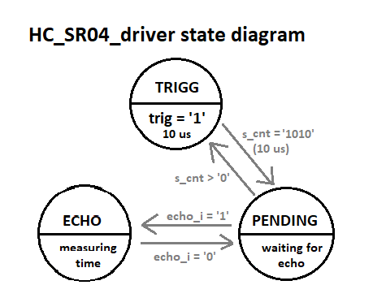

# Ultrasonic ranging module

## Summary

1. [Description](#Description)
2. [HC-SR04 module](#HC-SR04-module)
3. [Code description](#Code-description)
4. [Results](#Results)
5. [References](#References)

## Description

>Our goal in this project is creation of *field-programmable gate array* which will measure distance between  
>its sensors and a detectable object. The object must be at a distance between 2 centimeters and 4 meters
>and also must not deviate more than 15 degrees away from the detectors axis. 
>For this purpose we will be using [HC-SR04 module](#HC-SR04-module) mounted on Coolrunner II CPLD board.

### Schematic

 

## HC-SR04 module
*All informations about connection pins, functionality and timing* 
*have been drawn from enclosed HC-SR04.pdf file*
>This module consists of ultrasonic emitter and receiver and necessary circuitry to achieve its function. Connection with board 
>is transmitted via four pins as follows: **Ucc**, **Trig**, **Echo** and **GND**. **Ucc** and **GND** are 
>used for powering the module with **+5V** voltage. After sending 10us 40 kHz signal to **Trig** the module emitter sends out 
>burst of 8 40 kHz sonic pulse signals and waits for reflected signals. During this time, between sending and receiving, is signal 
>on pin **Echo** set to logic 1. 
	
## Code-description

>Our objective is to measure time of output from the module, convert it to distance and display it on the 4-digit 7-segment display.

## Results
### HC-SR04_driver

Driver for HC-SR04 module has three inputs: 

* 10 Mhz clock input 
* synchronous reset
* echo - signal timing modules output

and two outputs:

* trigg_o for triggering the module
* echo_time - binary time of echo signal in us, divided by two

This driver works as a Finite State Machine (FSM) with three states, described in following diagram.

 

The output time in form of a logic vector is already divided by two. This was accomplished by simply dividing by integer of 2. 
Other way to do this would be by shifting right by one bit, which was not necessary.
On the following picture is a screenshot of its simulation, particulary the moment between two measurements.

 

## References
